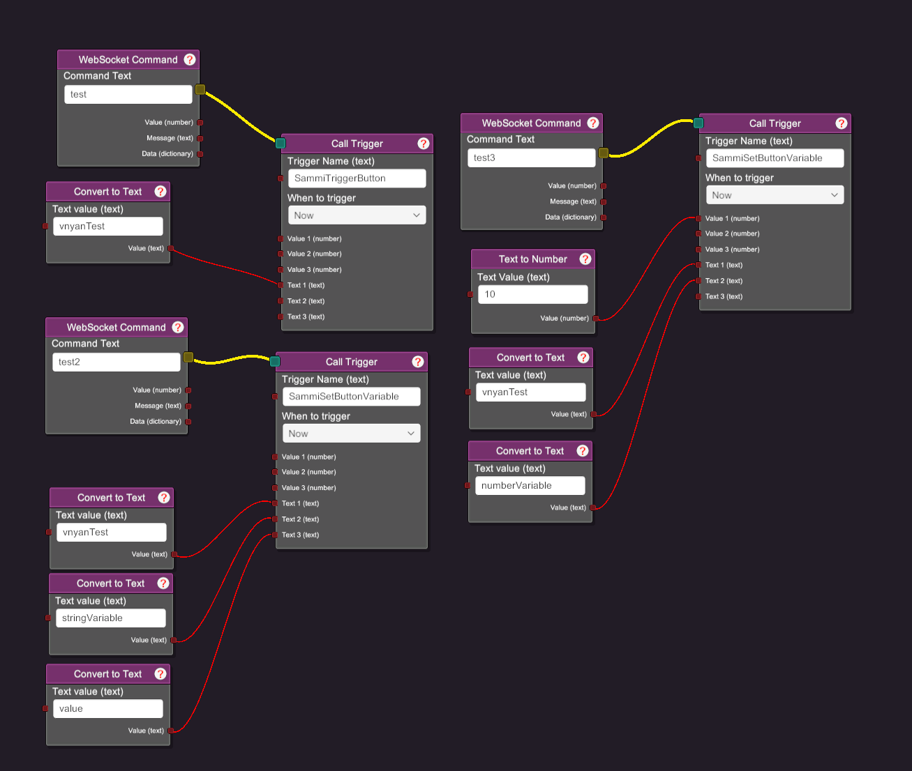

# SAMMI VNyan Plugin

This is a plugin for [VNyan](https://suvidriel.itch.io/vnyan) to talk to [SAMMI](https://sammi.solutions/) If you need to go the other direction (SAMMI controlling vnyan) please check out the [VNyan SAMMI Extension](https://github.com/swolekat/vnyan-sammi-extension)

## Installation
You will need to have the following installed and fully connected:
* VNyan
* SAMMI

Inside of VNyan you need to enable `Allow 3rd party Mods/Plugins (requires restart)` under the `Misc` category.

Inside of SAMMI you will need to enable `Open Local API Server`. To get to this menu, select `Settings` then `Connections`. 

Go to the latest release and download the zip file. Unzip it in your VNyan installation folder. Ultimately you should see both `SammiVnyanPlugin.dll` and `SammiVnyanPlugin.vnobj` in `Items\Assemblies`.

## Usage

Once the plugin is installed there are two types of triggers you can use.

First is the trigger to trigger a button in sammi. You'll use `SammiTriggerButton` for triggering button. Text 1 is the button ID of the sammi button you want to trigger.

However, you may want to set variables on a button before triggering it. For that you can use `SammiSetButtonVariable`. Here's the fields you can fill out:
* `Text 1` this is the ButtonID
* `Text 2` this is the name of the variable
* `Text 3` (optional) the value that you want the variable to be
* `Value 1` (optional) the value that you wan the variable to be

You should only have `Text 3` OR `Value 1`. If you have both, the string will "win".
